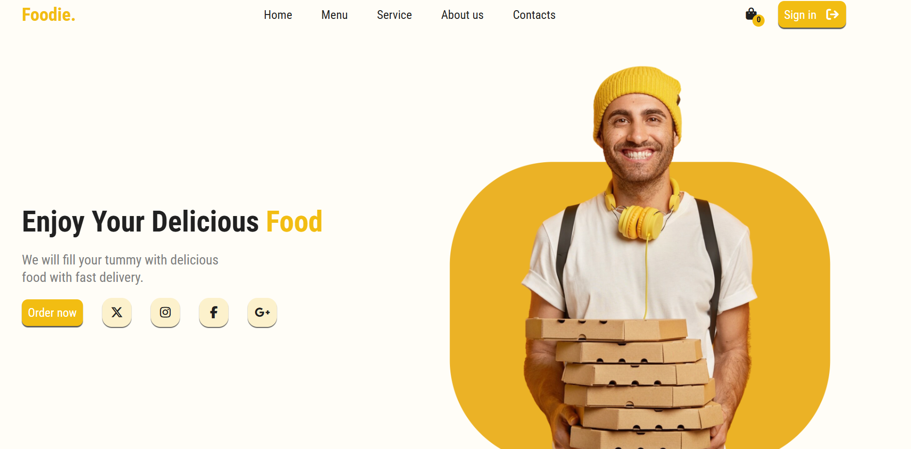
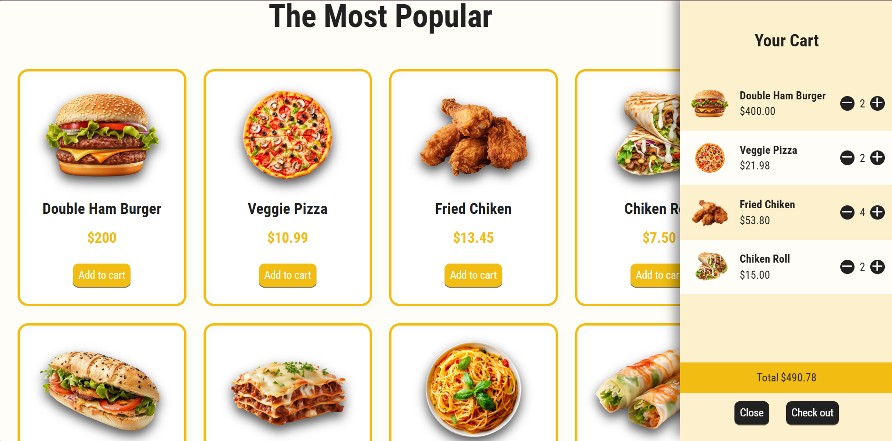

<<<<<<< HEAD

# Foodie Website 🍔🍕  

=======
# Foodie Website 🍔🍕  

>>>>>>> 29f2fa8ae3ca124a8f2279373e14d5558cdd140d
## Overview
Foodie is a fully responsive, interactive website built with **HTML, CSS, and JavaScript**.  
It allows users to browse delicious food items, add them to the cart, remove items, and see the total price in real-time.  
The website simulates a complete food ordering experience, including menus, services, reviews, and even a subscription feature.  

This project is ideal for anyone looking to create a **modern, user-friendly, and responsive food delivery web application**.

---

## Features
- **Fully Responsive Design** – Works seamlessly on desktops, tablets, and mobile devices.  
- **Interactive Menu** – Browse food items with images, names, and prices.  
- **Add to Cart / Remove Items** – Users can add items to the cart and remove them easily.  
- **Cart Total Calculation** – Updates total price and quantity dynamically.  
- **Service Highlights** – Easy to order, fast delivery, and best quality food.  
- **Customer Reviews** – View testimonials from satisfied customers.  
- **Mobile Application Section** – Information about app-based ordering for convenience.  
- **Newsletter Subscription** – Users can subscribe to stay updated.  
- **Smooth Animations & UI Effects** – Swiper.js for review carousel and interactive buttons.  

---

## Technologies Used
- **HTML5** – Structured and semantic markup.  
- **CSS3** – Modern responsive design, flexbox, and media queries.  
- **JavaScript (Vanilla)** – Dynamic DOM manipulation for cart, menu, and interactions.  
- **Swiper.js** – Review carousel functionality.  
- **Font Awesome** – Icons for social links, cart, and UI enhancements.  

<<<<<<< HEAD
---

=======

## Project Structure
>>>>>>> 29f2fa8ae3ca124a8f2279373e14d5558cdd140d
